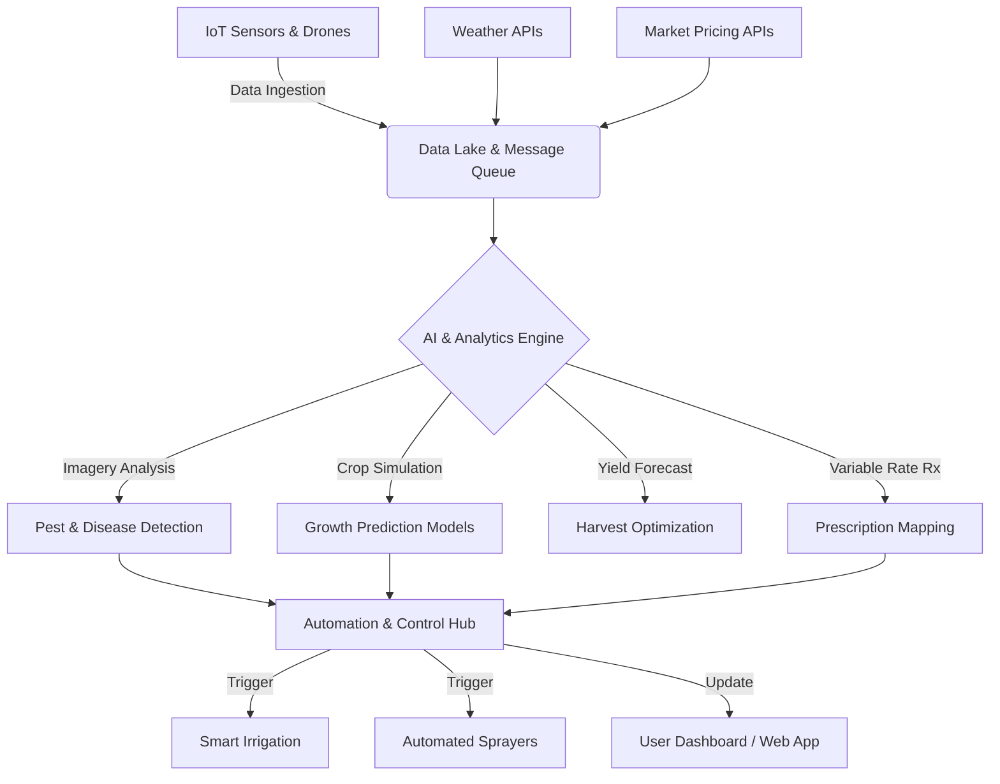

# AgriSense AI - Platform Architecture & Implementation Plan

Welcome to the architectural design and implementation plan for your integrated AI-powered farm management platform.

## 1. System Architecture Overview

The platform is designed as a cloud-native, event-driven architecture that continuously ingests agricultural data, processes it via AI models, and automates hardware interventions across the farm.

## 2. Core Modules Implementation

### Imagery Analysis & Computer Vision
- **Goal:** Detect pest infestations, nutrient deficiencies, and crop ripeness.
- **Tech Stack:** PyTorch / OpenCV for model training, YOLOv8 for real-time object detection on drone imagery.
- **Pipeline:** Scheduled drone flights capture multispectral imagery $\rightarrow$ Images uploaded to cloud $\rightarrow$ CV Models segment and classify anomalies $\rightarrow$ Automated alerts generated on the dashboard.

### IoT & Hardware Control Hub
- **Goal:** Connect and control irrigation, fertilizer, and spraying systems.
- **Tech Stack:** MQTT Protocol, AWS IoT Core / Azure IoT Hub.
- **Pipeline:** Field sensors (moisture, NPK) stream data continuously. When thresholds are breached, the platform securely dispatches payload commands to local PLCs (Programmable Logic Controllers) to activate valves and sprayers.

### Crop Growth Simulation Engine
- **Goal:** Test and compare interventions (seed variety, spacing, irrigation).
- **Tech Stack:** Python (scikit-learn, TensorFlow), Digital Twin models.
- **Pipeline:** Integrates historical farm data and ongoing trials. Users input parameters (e.g., "What if I plant Soybeans with 15-inch spacing?"), and the engine runs Monte Carlo simulations predicting harvest yield and date.

### Variable Rate Prescription (VRA) Maps
- **Goal:** Efficient spraying and watering based on localized field variations.
- **Tech Stack:** GeoJSON, PostGIS, Mapbox GL JS (Frontend).
- **Pipeline:** Translates multispectral NDVI (Normalized Difference Vegetation Index) data into spatial heatmaps. The system exports shapefiles/Rx maps directly to John Deere or Case IH tractor terminals.

### Market & Weather Integrations
- **Goal:** Combine weather forecasts and market demand for better planning.
- **Integrations:** 
  - *Weather:* OpenWeatherMap or NOAA APIs for 14-day forecasts.
  - *Market Data:* USDA APIs and commodities market feeds.
- **Actionable Output:** "Delay harvesting corn by 3 days; storm expected tomorrow, but market price projected to increase 2% by next week."

## 3. Frontend Web Application (Dashboard)

A prototype of the frontend dashboard has been built in this workspace using **React**, **Vite**, and **Vanilla CSS**. 

**Key Features of the Prototype:**
- **Glassmorphism UI:** A sleek, modern dark-mode aesthetic.
- **Dynamic Charts:** Built using Recharts to visualize Yield Projections vs Actuals, and Soil Moisture/Nutrient Tracking.
- **Prescription Map Viewer:** An interactive visualizer simulating variable rate zones.
- **Actionable AI Alerts:** Real-time notifications for automated irrigation events or pest risks.

## 4. Next Steps for Development

1. **Deploy the Prototype:** We can deploy the current React dashboard to Vercel or Netlify so you can interact with it on the web.
2. **Backend API Initialization:** Setup a Node.js/Express or Python/FastAPI backend to start serving mock hardware data.
3. **Database Schema:** Design the PostgreSQL schema for fields, sensors, interventions, and crop cycles.
4. **IoT Protocol Integration:** Set up an MQTT broker to begin accepting telemetry data from a prototype soil sensor.
